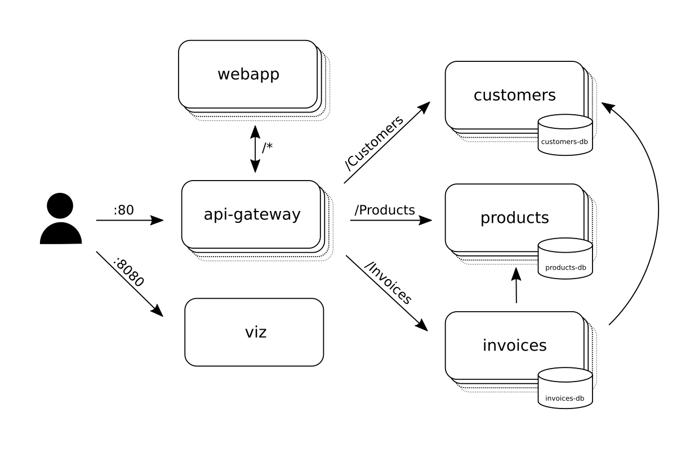
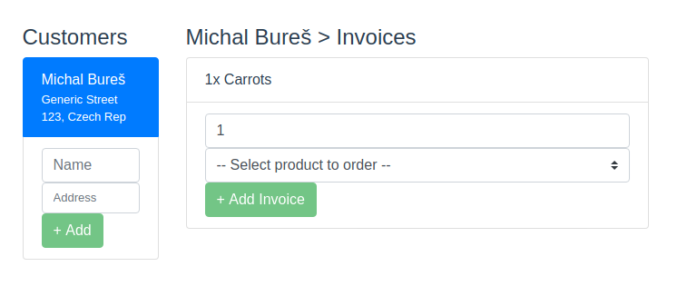
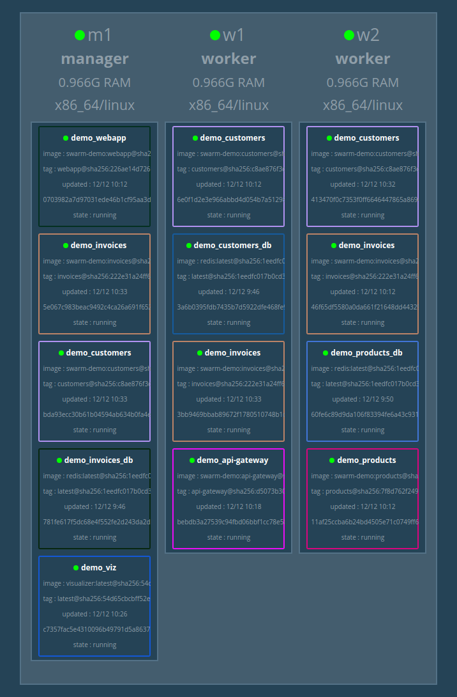

# Running a microservice network with Docker Swarm

This project is a minimalistic demonstration on how to run a swarm of microservices across multiple host machines using **Docker Swarm**.

Out of the box, Docker Swarm provides solutions for (among other things):
* Scaling services including load balancing between service instances
* Automatic distribution of containers across multiple nodes
* Recovery after a container or a whole machine crashed 
* Rolling upgrades with customizable strategies
* Virtual overlay network for inter-container communication

Docker Swarm makes it easy to run hundreds or thousands of interconnected containers and not even 
think about all the physical machines that provide the computing resources.

## The sample project

The sample project is a very simplified approximation of a system for managing customers, products and ionvices.
It's composed of the following services:

  

* **Customers**, **Products** and **Invoices**
    
  These are simple microservices with REST API (based on Node.js, Express and Tsoa), each with their own associated redis database.
  The **Invoices** service uses the *Customers* and *Products* API to validate new invoices.
  * *Customers* manages the collection of customers (each has id, name and address)
  * *Products* manages the collection of available products (each has id and name)
  * *Invoices* manages invoices (each invoice has id, product, customer and quantity). The service talks to the *Customers* and *Products* microservices to validate each new invoice.

* **Webapp**

  A simple frontend (written in Vue.js) that allows creating and displaying customers and inovices.

  

* **API-gateway**

  Simple nginx-based service which routes each request to the appropriate microservice (based on URL). 
  
* **Viz**

  An instance of [Docker Swarm Vizualizer](https://github.com/dockersamples/docker-swarm-visualizer), accessible in browser on port 8080.
  Used for basic monitoring of the swarm status.
   
  

## Setting up local test environment

Requires: VirtualBox, Docker with *Docker Machine*

### 1. Spin up the VMs

Our test cluster will have 3 nodes - one manager node (`m1`) and two worker nodes (`w1`, `w2`).

Run the following commands 

```
docker-machine create m1 --driver virtualbox
docker-machine create w1 --driver virtualbox
docker-machine create w2 --driver virtualbox
```

This will create and launch the 3 virtualbox VMs, `m1`, `w1` and `w2`. 

Verify with `docker-machine ls`.

### 2. Create the swarm

#### 2.1 Switch to the manager node `m1`:
```
eval $(docker-machine env m1)
```
This will change your `DOCKER_HOST` evn variable to the IP adress of `m1`, so all docker 
commands now run against this VM instead of your physical machine;
later, you can return to your physical machine with `eval $(docker-machine env -u)
`.

Verify with `docker-machine active`.

#### 2.2 Create new swarm with `m1` as manager
```
docker swarm init --advertise-addr $(docker-machine ip m1) 
```
Docker will print the command you should use for joining the other nodes 
to the cluster, copy it for use in the next step.

Verify with `docker node ls`.

#### 2.3 Connect the two worker nodes to the swarm
```
eval $(docker-machine env w1)
<join_command_from_step_2>
eval $(docker-machine env w2)
<join_command_from_step_2>
```

Verify with `docker node ls`.

### 3. Deploy the stack to the swarm
```
docker stack deploy demo --compose-file docker-compose.yml
```

Verify with `docker service ps`.
If any service is not running, investigate with `docker stack ps --no-trunc demo`.

### 4. Done!

To access the service in web browser, use the IP adress of any of the nodes.
For example `docker-machine ip w1`

Open `http://<node_ip>` to interact with the web application
Open `http://<node_ip>:8080` to see the cluster

## Exercises

Prerequisites: 
* Your swarm is up and running
* You are connected to the manager node (`eval $(docker-machine env m1)`) 

### Scaling service to multiple instances

```
docker service scale demo_customers=3
```

Verify with `docker service ps`

### Simulating a container dying

*Optional: To watch the swarm state in realtime, you can run `watch -d -n 0.5 docker service ls` in a separate console window.*

List the containers running on the manager node and kill one
```
docker ps
docker kill <container_id>
```
Watch how the swarm respawns the container automatically (with `docker service ps` or in browser at `http://<node_ip>:8080`) 

### Simulating a worker node dying

Visit `http://<node_id>:8080/` to see live visualisation of the swarm state.

Kill the `w2` node and watch how the lost containers are respawned on the remaining nodes. 
```
docker-machine kill w2
```
Restart the `w2` node
```
docker-machine start w2
```
Note that by default, Docker Swarm will **not** automatically redistribute the existing containers to a newly added node.
It will start using the new node only for new tasks (that is mostly when updating or scaling services).
Let's force some new tasks to be created for a few service:
```
docker service update --force customers
docker service update --force invoices
``` 
Watch how the new `customers` and `invoices` containers are spun up on the `w2` node again.

### Rolling upgrade
We will scale the `customers` service to 10 instances and do a rolling upgraed to version `2`

```
docker service update --update-delay 5s --image embair/swarm-demo:customers-v2
```

Watch how it gradually replaces the `demo_customers` containers with new version one by one, waiting for 5s inbetween each upgrade.
Besides the `--update-delay`, there are other arguments you can use to customize the upgrade process, for example:
* `--update-parallelism` to specify how many containers to upgrade simultaneously
* `--`

See the [official docs](https://docs.docker.com/engine/reference/commandline/service_update/) for rull reference.

All of this can also by configured in the `docker-compose.yml` file.

### Load balancing

By default, you can access any published service on any node in the docker swarm.
All requests are automatically load balanced between the nodes that have the corresponding Container using the automatically created Ingress network. For more information see [official docs](https://docs.docker.com/engine/swarm/ingress/) 

You can verify this by accessing the webapp in browser using the IP adress of each node.

List the ip adresses with
```
docker-machine ls
``` 

## Topics not covered
Some topics fell outside the scope of this sample project, but are nevertheless critical for successfully running microservices in production environment. These include: 

* Proper health-checking for each service
* Logging and monitoring
* Managing distributed transactions

To learn more about Microservice Architecture and Docker Swarm, I recommend these courses: 
   * [Microservices Architecture](https://app.pluralsight.com/library/courses/microservices-architecture/table-of-contents) by Rag Dihman
   * [Getting Started with Docker Swarm Mode](https://app.pluralsight.com/library/courses/docker-swarm-mode-getting-started/table-of-contents) by Wes Higbee  

